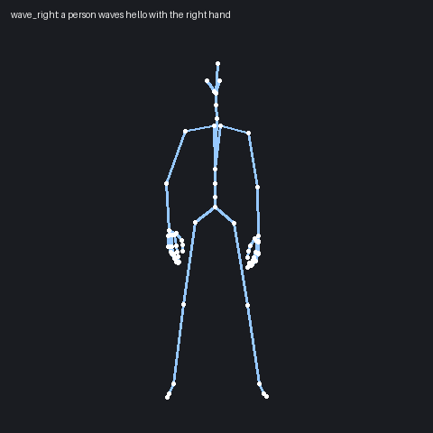
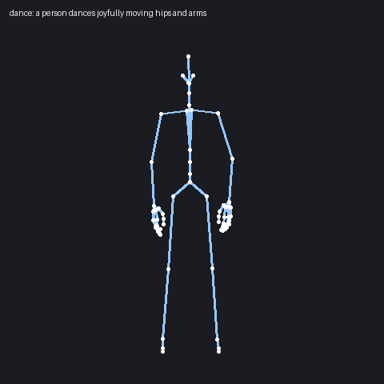
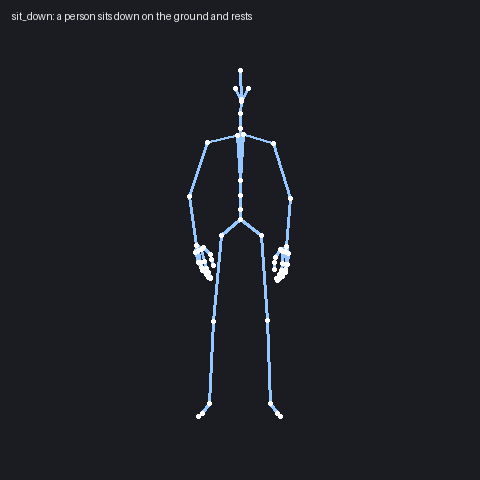
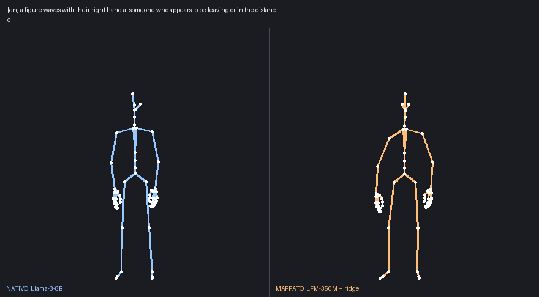
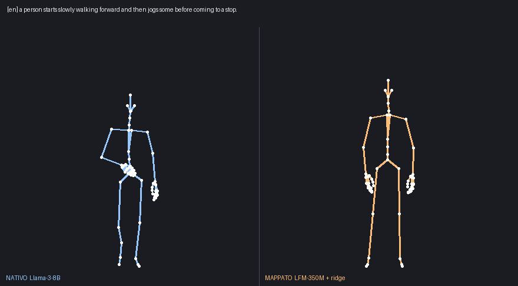
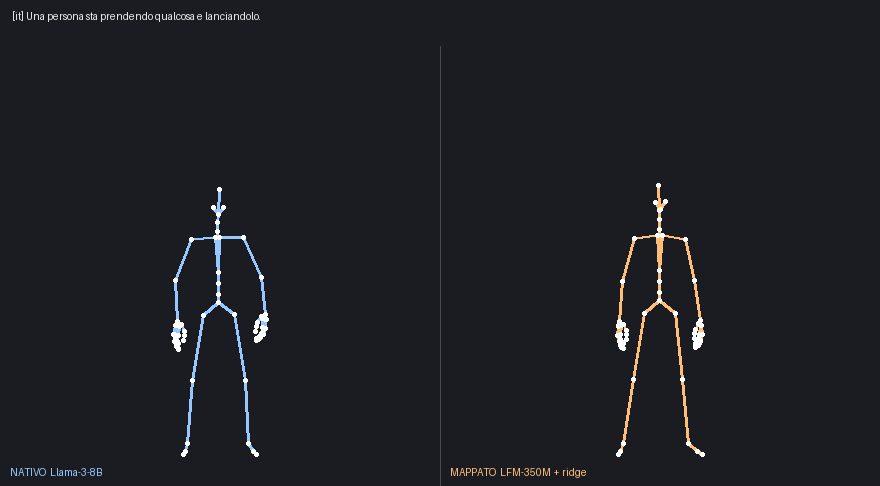
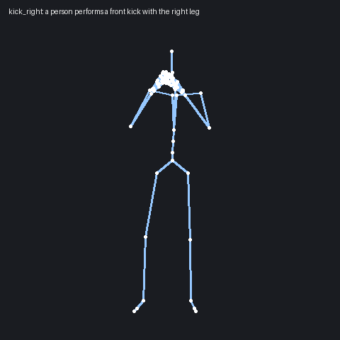

# lfm-to-kimodo

Scrivi una frase, esce un'animazione umana. Senza tenere in memoria un modello da 8 miliardi
di parametri solo per leggere il testo.

<p align="center">
  
  
  
</p>

NVIDIA Kimodo genera il movimento, ma non legge il testo: si aspetta un vettore prodotto da
LLM2Vec su Meta-Llama-3-8B. Sono 15 GB di pesi e 90-190 secondi a frase, per una cosa che poi
serve solo a condizionare il modello di movimento.

Qui quel pezzo è sostituito da **LFM2.5-Embedding-350M** più una mappa lineare che traduce i
suoi 1024 numeri nei 4096 che Kimodo si aspetta. Risultato: **0,7 secondi a frase**, 700 MB
invece di 15 GB, e il movimento regge.

In uscita: `.npz` nel formato Kimodo, `.bvh` da aprire in Blender o Unity, e una `.gif` di
anteprima se la vuoi.

## Regge davvero?

A sinistra l'encoder originale da 8B, a destra la mappa da 350M. Stessa frase.

<p align="center">
  <br>
  <br>
  
</p>

Il tipo di movimento ci arriva. I dettagli fini, quale mano o quale lato, ogni tanto derivano:
è una mappa lineare addestrata su 14 mila coppie, non un encoder. Per un personaggio in scena
basta e avanza; per motion capture da pubblicare, no.

L'ultima clip ha il prompt scritto in italiano e funziona lo stesso: LFM è multilingua, e la
mappa si porta dietro quella proprietà pur essendo stata costruita quasi tutta su coppie
inglesi.

| | originale | questa mappa |
|---|---|---|
| encoder | Llama-3-8B, 15 GB | LFM2.5, 700 MB |
| tempo a frase | 90-190 s | **0,7 s** |
| cosine, test inglese | riferimento | 0,815 |
| frase giusta al primo colpo, inglese | riferimento | 97,8 % |
| cosine, test italiano | riferimento | 0,701 |
| frase giusta al primo colpo, italiano | riferimento | 93,0 % |

Il test italiano è incrociato: frase in italiano, riferimento calcolato sull'inglese.

## Installazione

```bash
conda create -n motion python=3.11
conda activate motion
pip install torch --index-url https://download.pytorch.org/whl/cu121   # build adatta alla tua GPU
pip install -r requirements.txt
git clone https://github.com/nv-tlabs/kimodo
pip install -e kimodo
pip install ./kimodo/MotionCorrection      # separato: `pip install -e kimodo` non lo compila
```

Due modelli da scaricare, nessuno dei due è in questo repo:

| modello | note | spazio |
|---|---|---|
| `nvidia/Kimodo-SOMA-RP-v1.1` | serve accettare la licenza su Hugging Face e fare login | ~1,5 GB |
| `LiquidAI/LFM2.5-Embedding-350M` | libero | ~700 MB |

```bash
huggingface-cli login
huggingface-cli download nvidia/Kimodo-SOMA-RP-v1.1
huggingface-cli download LiquidAI/LFM2.5-Embedding-350M --local-dir ./modelli/LFM2.5-Embedding-350M
```

Kimodo se lo scarica da solo al primo avvio; a LFM devi indicare la cartella.

**Llama-3-8B non serve.** È il motivo per cui esiste questo repo.

## Uso

Due processi: il servizio embedding resta acceso, il generatore lo interroga.

```bash
# finestra 1, resta aperta
set LFM_MODEL=D:\modelli\LFM2.5-Embedding-350M        # export su Linux e macOS
python lfm_server.py

# finestra 2
python genera.py "a person waves hello with the right hand" --durata 3 --gif
```

```
embedding di 1 prompt via LFM...
carico Kimodo-SOMA-RP-v1.1...
  [0] 7.1s  a person waves hello with the right hand
       animazioni/00_a_person_waves_hello_with_the_right_hand.npz  +  .bvh
```

Il primo giro è più lento perché carica il modello. Poi sono circa 7 secondi per 3 secondi di
animazione, quasi tutti spesi nella diffusione.

| opzione | |
|---|---|
| `--durata N` | secondi, massimo 10 per prompt |
| `--passi N` | passi di diffusione, default 100: meno significa più veloce e più sporco |
| `--file lista.txt` | un prompt per riga, li fa tutti |
| `--out CARTELLA` | dove scrivere |
| `--gif` | anteprima animata dello scheletro |
| `--tpose` | BVH con rest pose a T invece di quella del dataset SEED |

| variabile | |
|---|---|
| `LFM_MODEL` | cartella del modello LFM, obbligatoria per `lfm_server.py` |
| `LFM_PORT`, `LFM_DEVICE` | porta e `cuda` oppure `cpu` |
| `LFM_URL` | dove il generatore cerca il servizio, default `http://127.0.0.1:8790/embed` |
| `MAP_DIR` | cartella della mappa, default `mappa/` |
| `KIMODO_MODEL` | un altro checkpoint Kimodo |
| `HF_HOME` | dove tenere la cache dei modelli |
| `KIMODO_REPO` | il clone di kimodo, serve a `tools/npz_to_gif.py` |

## Cosa esce

**`.npz`**, il formato nativo: 77 giunti (`somaskel77`), 30 fps.

| chiave | forma | |
|---|---|---|
| `local_rot_mats` | (T, 77, 3, 3) | rotazioni locali |
| `global_rot_mats` | (T, 77, 3, 3) | rotazioni globali |
| `posed_joints` | (T, 77, 3) | posizioni dei giunti, metri |
| `root_positions` | (T, 3) | bacino |
| `foot_contacts` | (T, 6) | contatti di tacco e punta |

Y in alto, +Z in avanti, metri, terna destrorsa.

**`.bvh`**, lo scheletro animato con gerarchia e offset in centimetri. Si importa in Blender
(`File > Import > Motion Capture`), Maya, MotionBuilder, Cascadeur. Nomi delle ossa in stile
Mixamo: `Hips`, `Spine1`, `Spine2`, `Chest`, `Neck1`, `Head`, `LeftShoulder`, `LeftArm`,
`LeftForeArm`, `LeftHand`, dita complete, `LeftLeg`, `LeftShin`, `LeftFoot`, `LeftToeBase`.

**`.gif`**, solo per dare un'occhiata.

## Prompt che funzionano

Linee guida NVIDIA, confermate dall'uso:

- comincia con "A person...", è lo stile dei dati di addestramento. Si può caratterizzare:
  "An old person...", "A drunk person..."
- una o due azioni per prompt; per sequenze lunghe, più prompt in fila
- dettaglio medio: "A person walks." è troppo poco, descrivere ogni arto è troppo
- resta nel dominio allenato: locomozione, gesti, attività quotidiane, oggetti comuni,
  combattimento da videogioco, danza, e stili come stanco, arrabbiato, felice, triste,
  spaventato, ubriaco, ferito, furtivo, vecchio, infantile
- fuori da quel dominio si degrada in fretta. "A baseball player swings a bat" non funziona,
  il baseball nei dati non c'è

<p align="center"></p>

## Unity

In `unity/` c'è il lato motore, costruito sopra il plugin
[Amin-HP/Kimodo-Unity](https://github.com/Amin-HP/Kimodo-Unity) (Apache-2.0), che fa il
retargeting in muscle space su qualunque personaggio con rig Humanoid.

**Clip già pronte.** `tools/npz_to_kimodo_json.py` converte gli `.npz` nel JSON che il plugin
si aspetta, `KimodoLibraryBaker.cs` li cuoce in `AnimationClip` Humanoid, `KimodoTestScene.cs`
monta una scena con un personaggio e un Animator che le contiene tutte. Nessun server acceso,
gira anche su un visore.

**Generazione dal vivo.** Al posto di `genera.py`:

```bash
cd bridge
python -m kimodo_bridge_lfm --port 8765
```

Stessi endpoint del server originale (`/health`, `/models`, `/skeleton`, `/generate`,
`/progress`), con LFM dentro al posto di Llama. Il plugin Unity ci si collega senza modifiche.
`KiraLiveMotion.cs` fa lo stesso da codice, e puntando `baseUrl` all'indirizzo del PC funziona
anche da un Quest.

## Tre trappole che costano ore

**Le `local_rot_mats` dell'npz non si passano a un rig esterno così come sono.** Il percorso
giusto parte dalle globali: `global_rots_to_local_rots(global_rot_mats, somaskel77)`. E la
radice si prende da `posed_joints[:, root_idx, :]`, non da `root_positions`. Il bridge lo fa
già.

**La radice dello scheletro non va lasciata a y = 0.** `neutral_joints` la tiene nell'origine,
e un rig costruito così fa calcolare a Unity un `humanScale` di circa 0,009: crede che il
personaggio sia alto nove millimetri, `HumanPoseHandler` restituisce `bodyPosition.y` intorno
a -106 e il modello sparisce sottoterra. Va alzata all'altezza dell'anca, cioè
`-min(neutral_joints[:, 1])`, circa 1 metro.

**Se la posa arriva da `SetHumanPose`, fuori dal ciclo dell'Animator, lo SkinnedMeshRenderer
non ricalcola**: vedi la bind pose mentre le ossa sono già al posto giusto. Servono
`updateWhenOffscreen = true` e `forceMatrixRecalculationPerRender = true`.

## Limiti

- massimo 10 secondi per prompt
- **solo scheletro umano**: `somaskel77` e `somaskel30`, il robot G1 a 34 giunti, SMPL-X a 22.
  Non si definiscono scheletri nuovi. I constraint (waypoint, keyframe di posa, end-effector,
  contatti dei piedi) spostano la posa umana, non creano un rig. Per animare una creatura
  diversa, o una sedia che cammina, la si riga in Blender e ci si ritarga sopra il movimento
  umano
- meno di 20 keyframe per tipo di constraint
- la mappa è beta: tipo di movimento giusto, dettagli fini approssimati

## Com'è fatta la mappa

Ridge lineare, 1024 ingressi, 4096 uscite, `lam = 1e-4`, addestrata su 14 mila coppie di
embedding: LFM da una parte, LLM2Vec-Llama-3-8B dall'altra, stessa frase.

In avanti: centra con `mu_x`, normalizza L2, moltiplica per `W`, normalizza L2, riscala per
`norm_y_media`, somma `mu_y`. Le due normalizzazioni servono perché i due spazi hanno norme
molto diverse e Kimodo è sensibile alla norma del vettore, non solo alla direzione.

Una MLP a 4 strati con SELU è stata provata e ha perso, 0,726 contro 0,815: con 14 mila coppie
non ha abbastanza dati per battere una mappa lineare.

I pesi stanno anche su Hugging Face, con la scheda:
<https://huggingface.co/adriandj3/LFM2.5-to-Llama8B-LLM2Vec-Kimodo>

## Contenuto

```
genera.py            prompt -> npz + bvh (+ gif)
lfm_server.py        servizio embedding LFM, porta 8790
mappa/               W, mu_x, mu_y, config
bridge/              server HTTP compatibile col plugin Unity, con LFM dentro
tools/               npz -> gif, npz -> json per Unity
unity/               tre script C#
img/                 le gif di questa pagina
```

## Link

- [la mappa su Hugging Face](https://huggingface.co/adriandj3/LFM2.5-to-Llama8B-LLM2Vec-Kimodo)
- [LLM2Vec-8B su una GPU da 8 GB, e batch che non rovina gli embedding](https://github.com/ArtyomITA/llm2vec-8gb-offload-lossless-batching)
- [Kimodo](https://github.com/nv-tlabs/kimodo)
- [il plugin Unity di partenza](https://github.com/Amin-HP/Kimodo-Unity)
- [LFM2.5-Embedding-350M](https://huggingface.co/LiquidAI/LFM2.5-Embedding-350M)

## Licenze

Il codice di questo repo è Apache-2.0, come il plugin Unity da cui deriva il bridge. Kimodo,
LFM e SMPL-X hanno ciascuno la propria: Kimodo e SMPL-X sono per uso di ricerca, da leggere
prima di metterli in qualcosa di commerciale.
